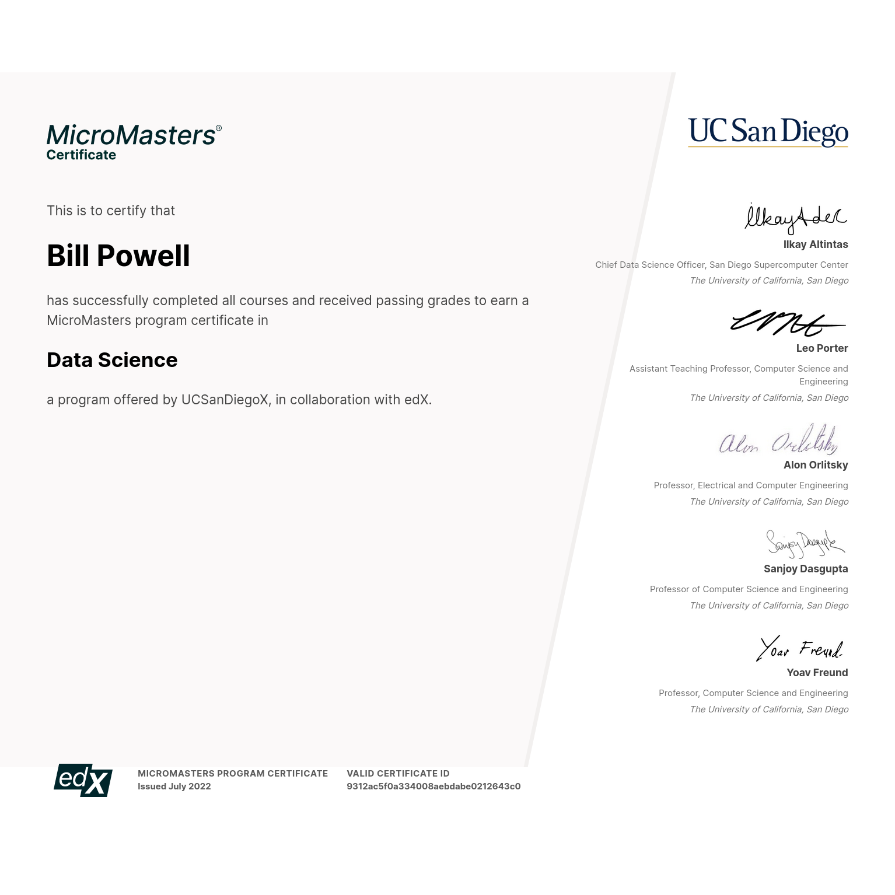
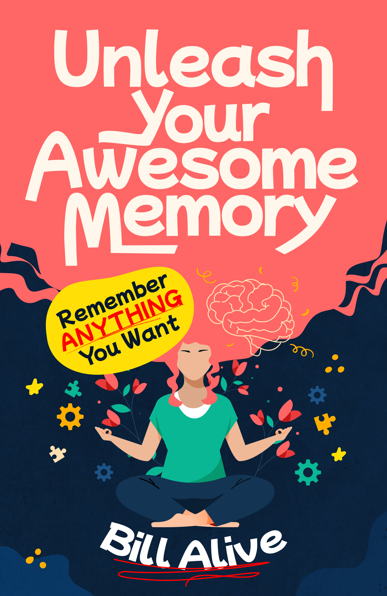
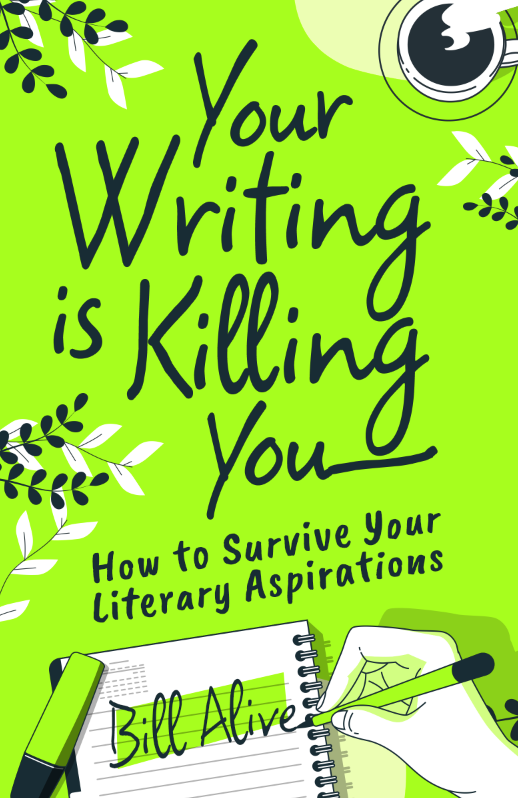
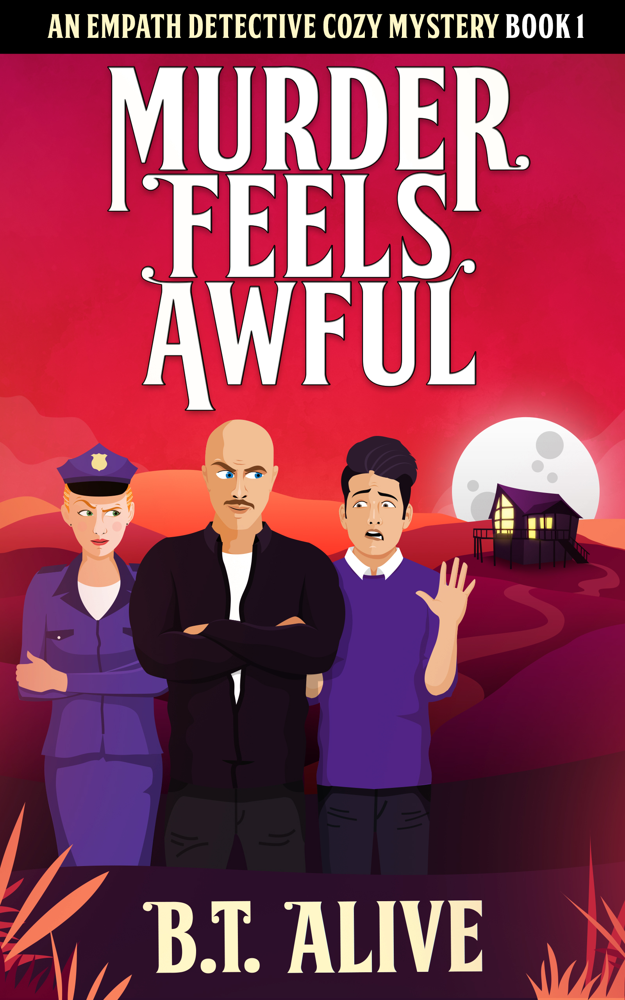

# Writer. Coder. Data Scientist.

## A Rare Intersection of Skills

Coding? Writing? Data Science? I offer you the complete package. Do you need:

- A **data scientist** who can also tell a **compelling story?**
- A **technical writer** who can also **code?**
- A **coder** who can also **communicate?**

I’d love to help.

## My Ideal Client

A **mission-driven organization** working to solve a **global problem** that **doesn’t get enough attention.** 

## Data Science

### Certification

I hold a [Micromasters Certificate in Data Science](https://data.billalive.com/certification) from the University of California San Diego. 

 

### Reports

I've published [several reports](https://data.billalive.com) as Jupyter Notebooks, each of which explores a complex question using an official dataset.

- [Your Real Odds of Dying From COVID-19 in the U.S.](https://data.billalive.com/21b18-covid-risks/)
- [Does Diabetes Correlate With Affluence?](https://data.billalive.com/22715-diabetes-correlate-affluence/)
- [Do Countries Have "Synthetic" Traits?](https://data.billalive.com/22719-country-synthetic-traits/)

 

### Interactive Game

Explore the hard data of COVID-19 risks and the case for vaccines in a quirky, nonjudgmental game.

 

## Coding

 

### Yarm

Create reports easily from SQL queries on spreadsheets and CSVs, and configure it all in YAML. 

A Python command-line tool.

[Documentation](https://yarm.readthedocs.io/) |
[Source](https://github.com/billalive/yarm) | 
[PyPI](https://pypi.org/project/yarm/)

 

## Web Development

<blockquote>

“Heartfelt thanks to Bill Powell… who developed this website and with infinite patience and contagious enthusiasm taught [us] to maintain it ourselves.”

<cite>Traverse City, Michigan</cite>
</blockquote>

### Writing

#### Nonfiction: Tech Writing, Memory Improvement, For Writers

 

> "You are competent and honest and communicate very well  
> (a rare quality in a techie 🙂)."
> <cite>Gower, Missouri</cite>

### Fiction Writing

#### Mystery, Humor, SF, Kids

 

_Note: My real name is **Bill Powell**, but my (favorite) pen name is **Bill Alive**._

### People Skills

#### Customer Care, Art Director, Community

 

> “We have never found anyone who has understood what we wanted...
> something simple but beautiful... You don’t realize how rare you are!”
> <cite>Kansas City, Missouri</cite>

